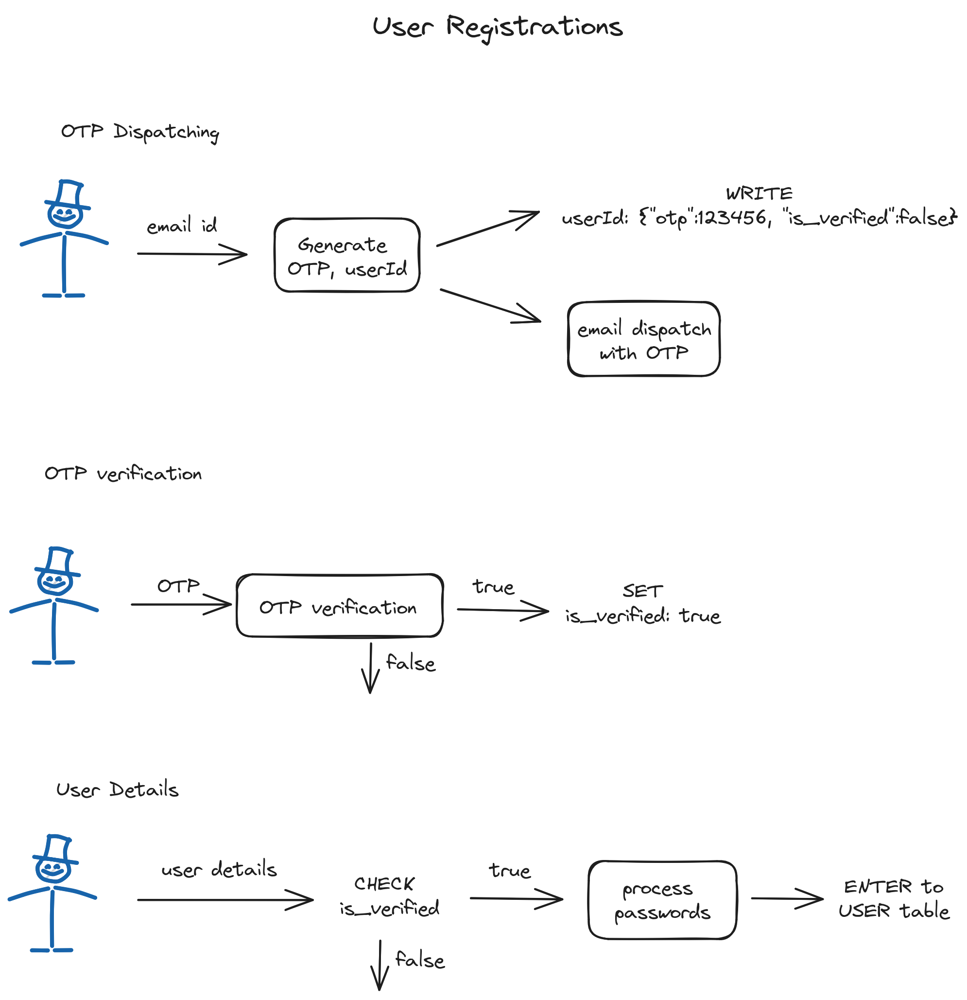

## CloudKeep Backend

### OVERVIEW

"CloudKeep" is a cloud-based file storage and sharing platform. Aims to provide a features similar to google drive service.
Utilising chunk based file uploading pipeline, it provides faster upload speeds and resumeable uploads.

### QUICK START

Download & Install Docker

`git clone https://github.com/shripadaRao/CloudKeep.git `

`sudo docker-compose up --build`

### API DESIGN

##### User Registration

Description: Allows users to create a new account. To configure the template of email, head to config/registerEmailTemplate.json.

1. `POST` `/api/register/send-email-otp`

###### Description: Send an OTP email to a user

Request Body:

```
{
    "userId": string,
    "userEmail": string
}
```

2. `POST` `/api/register/verify-otp`

```
request body:
{
    "OTP": string,
    "userId": string,
    "userEmail": string
}
```

3. `POST` `/api/register/create-user`

```
request body:
{
    "userName": string,
    "userId": string,
    "password": string,
    "userEmail": string
}
```

### Design

##### User Registrations



##### User Login


