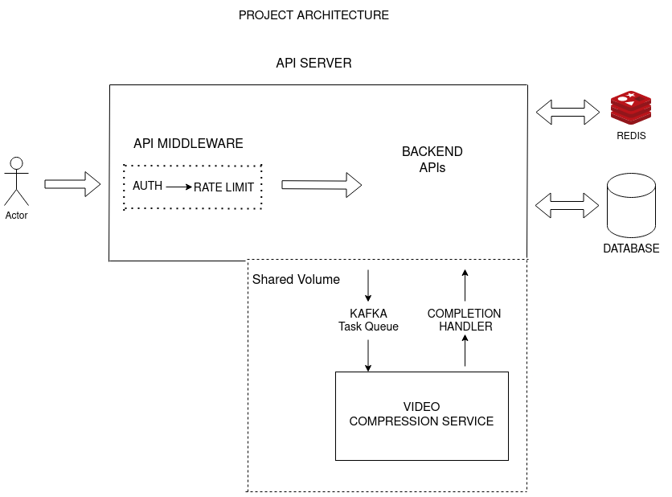
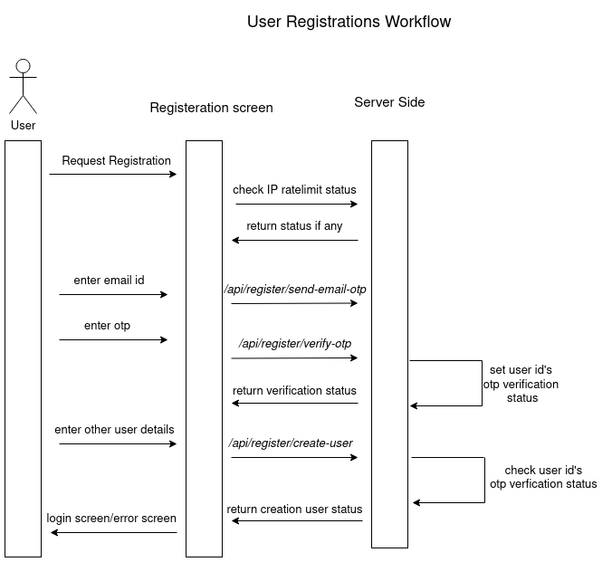
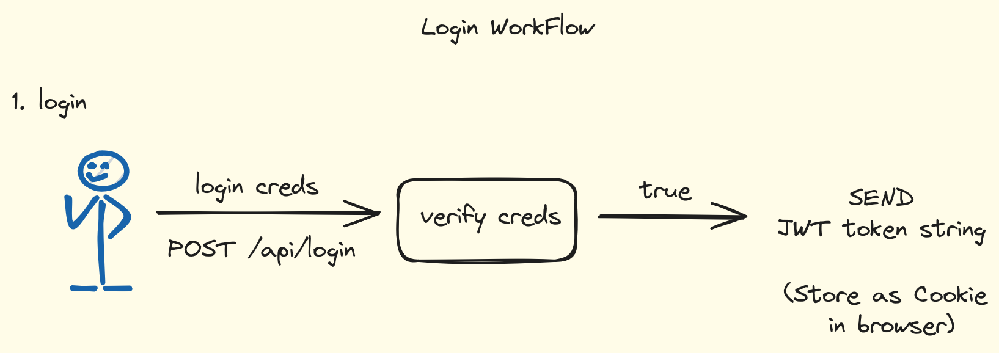
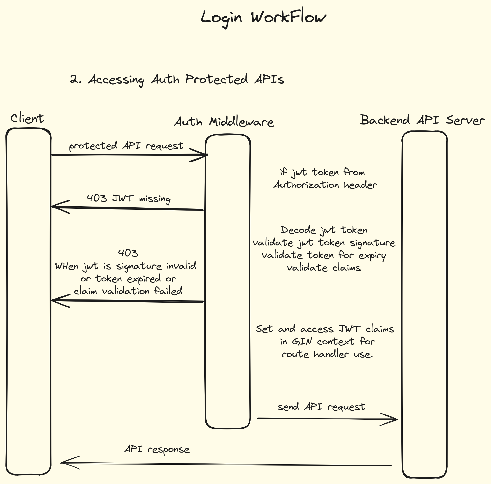
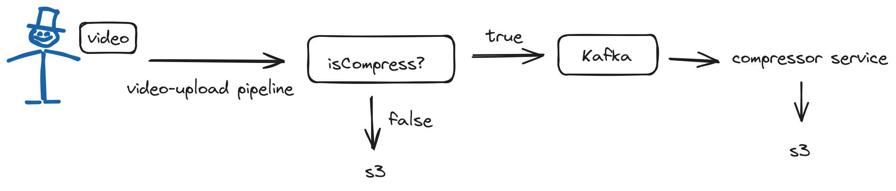
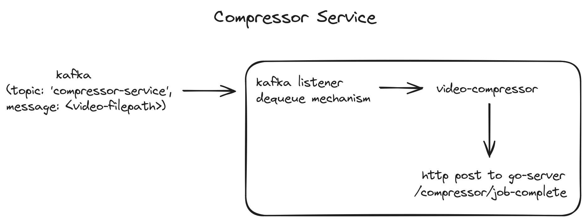

## CloudKeep Backend

### OVERVIEW

"CloudKeep" is a cloud-based file storage and sharing platform. Aims to provide a features similar to google drive service.
Utilising chunk based file uploading pipeline, it provides faster upload speeds and resumeable uploads.

### QUICK START

Download & Install Docker

`git clone https://github.com/shripadaRao/CloudKeep.git `

cd into CloudKeep

`sudo docker-compose up --build`

### Project Functionalities

##### User Registration

Users can create an account using their email, receiving an OTP for verification. Upon entering the OTP and providing required details, the account is generated. Customize the registration email template in config/registerEmailTemplate.json.

##### User Login

Users log in with their userID and password. After successful login, a JWT is sent, stored as a cookie for authentication in subsequent API requests. Forgot Password and Multi-Factor Authentication (MFA) is under development.

##### Video Uploads

Users can upload videos to the server using a chunked upload mechanism. This mechanism allows speedy uploads. The client-side chunks are sent to the server in parallel, where they are reconstructed, and checksums are used to verify data integrity. Upon successful reconstruction, the video file is pushed to S3 storage.

Future Work:

- Automated Video Captioning, label generation and other video processing.
- Resumeable Uploads

##### Rate Limiting

Each request is rate limited using token bucket algorithm implemented with redis.
It is designed as a layered system. There is global rate limiting and user based rate limiting.
Each api request has a cost factor which consumes different amount of tokens.

##### Video Compression

### Project Architecture

#### User Registrations

##### User Login

##### Video upload pipeline with Compressor Service

##### Compressor Service

